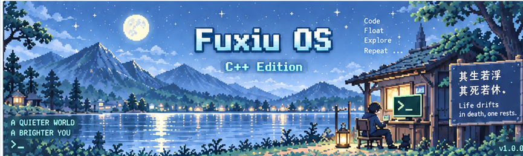
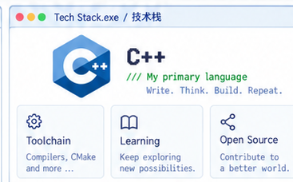
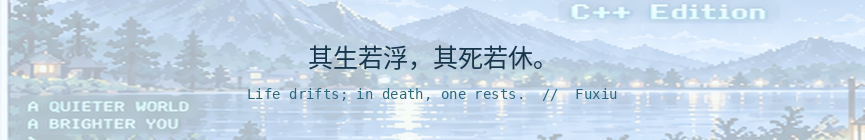

<!-- Fuxiu OS / Floating Life  —  high-fidelity concept-based version. -->

<picture>
  <source media="(prefers-color-scheme: dark)" srcset="./assets/pixel/banner-dark.png">
  <source media="(prefers-color-scheme: light)" srcset="./assets/pixel/banner-light.png">
  
</picture>

<!-- 静态美术依据先前确认的设计稿；真实数据由下方 GitHub Actions 维护。 -->
<table>
<tr>
<td width="56%" valign="top" align="center">

<!-- 自动头像配置：将下方 `https://github.com/WuFuxiu.png?size=200` 中的 WuFuxiu 替换为其它用户名，即可跟随其它用户的 GitHub 头像。 -->
<!-- Welcome.exe: 头像从 GitHub 用户资料动态获取，而不是烘焙在静态 PNG 中。 -->
<picture>
  <source media="(prefers-color-scheme: dark)" srcset="./assets/pixel/welcome-title-dark.svg">
  <source media="(prefers-color-scheme: light)" srcset="./assets/pixel/welcome-title-light.svg">
  
</picture>

<table>
  <tr>
    <td width="120" align="center" valign="middle">
      
    </td>
    <td valign="middle" align="left">
      <b>Hi, I'm Fuxiu</b> 
      你好，我是 Fuxiu 
      <a href="https://github.com/WuFuxiu"><b>@WuFuxiu</b></a>  
      <code>$ cat motto.txt</code> 
      <b>其生若浮，其死若休。</b> 
      Life drifts; in death, one rests.
    </td>
  </tr>
</table>

</td>
<td width="44%" valign="top" align="center">

<picture>
  <source media="(prefers-color-scheme: dark)" srcset="./assets/pixel/tech-dark.png">
  <source media="(prefers-color-scheme: light)" srcset="./assets/pixel/tech-light.png">
  
</picture>

</td>
</tr>
</table>

   

  <b>C++</b> is my foundation. With AI programming, I now build across whatever the problem needs. / <b>C++</b> 是我的底色；因为 AI 编程，我现在会根据问题去使用不同语言与工具。

<!-- 统计卡片由 GitHub Actions 使用真实仓库数据自动生成。 -->
<table>
<tr>
<td width="50%" valign="top" align="center">

<picture>
  <source media="(prefers-color-scheme: dark)" srcset="./assets/pixel/stats-title-dark.svg">
  <source media="(prefers-color-scheme: light)" srcset="./assets/pixel/stats-title-light.svg">
  
</picture>

<picture>
  <source media="(prefers-color-scheme: dark)" srcset="./assets/generated/stats-dark.svg">
  <source media="(prefers-color-scheme: light)" srcset="./assets/generated/stats-light.svg">
  
</picture>

</td>
<td width="50%" valign="top" align="center">

<picture>
  <source media="(prefers-color-scheme: dark)" srcset="./assets/pixel/languages-title-dark.svg">
  <source media="(prefers-color-scheme: light)" srcset="./assets/pixel/languages-title-light.svg">
  
</picture>

<picture>
  <source media="(prefers-color-scheme: dark)" srcset="./assets/generated/langs-dark.svg">
  <source media="(prefers-color-scheme: light)" srcset="./assets/generated/langs-light.svg">
  
</picture>

</td>
</tr>
</table>

数据来自 GitHub 公开统计；语言占比反映仓库代码构成，不代表技术熟练度。虽然我以 C++ 为主，但因为 AI 编程与实验，仓库里会出现更多语言。 / Language breakdown reflects repository code, not proficiency. C++ is still my core language, but AI-driven work makes this profile more polyglot.

<picture>
  <source media="(prefers-color-scheme: dark)" srcset="./assets/pixel/monitor-title-dark.svg">
  <source media="(prefers-color-scheme: light)" srcset="./assets/pixel/monitor-title-light.svg">
  
</picture>

<picture>
  <source media="(prefers-color-scheme: dark)" srcset="https://github-readme-activity-graph.vercel.app/graph?username=WuFuxiu&amp;theme=react-dark&amp;hide_border=true&amp;area=true">
  <source media="(prefers-color-scheme: light)" srcset="https://github-readme-activity-graph.vercel.app/graph?username=WuFuxiu&amp;theme=github-compact&amp;hide_border=true&amp;area=true">
  
</picture>

<picture>
  <source media="(prefers-color-scheme: dark)" srcset="./assets/pixel/recent-title-dark.svg">
  <source media="(prefers-color-scheme: light)" srcset="./assets/pixel/recent-title-light.svg">
  
</picture>

<!-- ACTIVITY:START -->
- `2026-10-05` · 🔀 Worked on a pull request / 参与拉取请求 · [LinYang-github/team-agent-skills](https://github.com/LinYang-github/team-agent-skills)
- `2026-10-04` · 🌱 Created a branch or repo / 创建分支或仓库 · [LinYang-github/team-agent-skills](https://github.com/LinYang-github/team-agent-skills)
- `2026-10-04` · 🔀 Worked on a pull request / 参与拉取请求 · [LinYang-github/team-agent-skills](https://github.com/LinYang-github/team-agent-skills)
- `2026-09-28` · ⬆️ Pushed code / 推送代码 · [LinYang-github/team-agent-skills](https://github.com/LinYang-github/team-agent-skills)
- `2026-09-28` · 🔀 Worked on a pull request / 参与拉取请求 · [LinYang-github/team-agent-skills](https://github.com/LinYang-github/team-agent-skills)
<!-- ACTIVITY:END -->

<picture>
  <source media="(prefers-color-scheme: dark)" srcset="./assets/pixel/snake-title-dark.svg">
  <source media="(prefers-color-scheme: light)" srcset="./assets/pixel/snake-title-light.svg">
  
</picture>

<picture>
  <source media="(prefers-color-scheme: dark)" srcset="https://raw.githubusercontent.com/WuFuxiu/WuFuxiu/output/github-snake-dark.svg">
  <source media="(prefers-color-scheme: light)" srcset="https://raw.githubusercontent.com/WuFuxiu/WuFuxiu/output/github-snake.svg">
  
</picture>

Eat contributions. Keep moving. / 积累每一次贡献，持续前行。

<b>WakaTime.exe · 编码时长（等待配置 / Not connected yet）</b>

WakaTime 尚未接入。接入后再展示真实编码时长。当前因为 AI 编程与实验，我会频繁在不同语言和工具之间切换。 / Coding time will appear after WakaTime is connected. Lately, AI work has me moving across many languages and tools.

<b>interests.txt · 兴趣与探索（以后补充）</b>

Current focus / 当前关注：<b>C++</b> as the core, plus AI coding across multiple stacks / 以 <b>C++</b> 为核心，同时进行 AI 编程与多语言开发。

<picture>
  <source media="(prefers-color-scheme: dark)" srcset="./assets/pixel/visitors-title-dark.svg">
  <source media="(prefers-color-scheme: light)" srcset="./assets/pixel/visitors-title-light.svg">
  
</picture>

 

<picture>
  <source media="(prefers-color-scheme: dark)" srcset="./assets/pixel/footer-dark.png">
  <source media="(prefers-color-scheme: light)" srcset="./assets/pixel/footer-light.png">
  
</picture>

