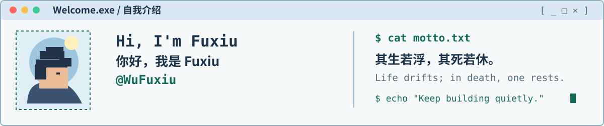
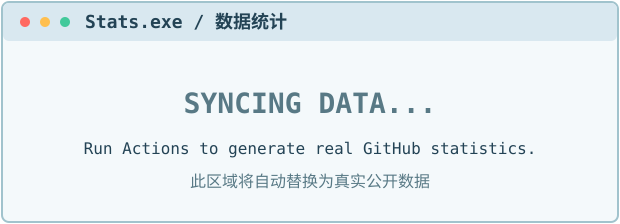
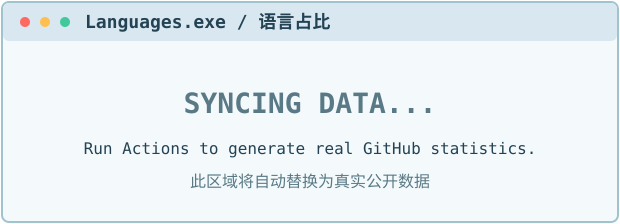

<!--
Fuxiu OS × Floating Life | GitHub Profile README
GitHub: https://github.com/WuFuxiu
Theme assets: ./assets/
The current GitHub stats placeholders are replaced by the stats workflow.
The contribution snake appears after the first successful Snake workflow run.
-->

<div align="center">

  <picture>
    <source media="(prefers-color-scheme: dark)" srcset="./assets/banner-dark.svg">
    <source media="(prefers-color-scheme: light)" srcset="./assets/banner-light.svg">
    
  </picture>

  <a href="https://github.com/WuFuxiu">
    
  </a>

  <br>
  
  
  

</div>

<div align="center">
  <picture>
    <source media="(prefers-color-scheme: dark)" srcset="./assets/welcome-dark.svg">
    <source media="(prefers-color-scheme: light)" srcset="./assets/welcome-light.svg">
    
  </picture>
</div>

### `> ./Tech_Stack.exe` · 技术栈

<div align="center">
  <a href="https://isocpp.org/">
    
  </a>
  <br>
  <strong>C++</strong> · My primary language / 我的主要编程语言
  <br>
  <sub>Write. Think. Build. Repeat. / 编写 · 思考 · 构建 · 精进</sub>
</div>

<!-- 当你确认使用的工具时，可以在这里添加 Git、CMake、Linux、VS Code 等图标。 -->

### `> ./Stats.exe` · GitHub 数据统计

<!-- 这两个 SVG 会由 .github/workflows/stats.yml 定期替换为真实统计数据。 -->
<table>
  <tr>
    <td width="50%" align="center">
      <picture>
        <source media="(prefers-color-scheme: dark)" srcset="./assets/generated/stats-dark.svg">
        <source media="(prefers-color-scheme: light)" srcset="./assets/generated/stats-light.svg">
        
      </picture>
    </td>
    <td width="50%" align="center">
      <picture>
        <source media="(prefers-color-scheme: dark)" srcset="./assets/generated/langs-dark.svg">
        <source media="(prefers-color-scheme: light)" srcset="./assets/generated/langs-light.svg">
        
      </picture>
    </td>
  </tr>
</table>

<sub>Languages / 语言占比显示的是公开仓库代码分布，不代表个人熟练度。</sub>

### `> ./Activity_Monitor.exe` · 贡献趋势

<picture>
  <source media="(prefers-color-scheme: dark)" srcset="https://github-readme-activity-graph.vercel.app/graph?username=WuFuxiu&amp;theme=react-dark&amp;hide_border=true&amp;area=true">
  <source media="(prefers-color-scheme: light)" srcset="https://github-readme-activity-graph.vercel.app/graph?username=WuFuxiu&amp;theme=github-compact&amp;hide_border=true&amp;area=true">
  
</picture>

### `> tail -n 5 Recent_Activity.log` · 近期动态

<!-- ACTIVITY:START -->
- `2026-10-05` · 🔀 Worked on a pull request / 参与拉取请求 · [LinYang-github/team-agent-skills](https://github.com/LinYang-github/team-agent-skills)
- `2026-10-04` · 🌱 Created a branch or repo / 创建分支或仓库 · [LinYang-github/team-agent-skills](https://github.com/LinYang-github/team-agent-skills)
- `2026-10-04` · 🔀 Worked on a pull request / 参与拉取请求 · [LinYang-github/team-agent-skills](https://github.com/LinYang-github/team-agent-skills)
- `2026-09-28` · ⬆️ Pushed code / 推送代码 · [LinYang-github/team-agent-skills](https://github.com/LinYang-github/team-agent-skills)
- `2026-09-28` · 🔀 Worked on a pull request / 参与拉取请求 · [LinYang-github/team-agent-skills](https://github.com/LinYang-github/team-agent-skills)
<!-- ACTIVITY:END -->

### `> ./Snake.exe` · 贡献贪吃蛇

<!-- 第一次运行 snake.yml 前，output 分支尚不存在，下面的动画可能暂时不显示。 -->
<div align="center">
  <picture>
    <source media="(prefers-color-scheme: dark)" srcset="https://raw.githubusercontent.com/WuFuxiu/WuFuxiu/output/github-snake-dark.svg">
    <source media="(prefers-color-scheme: light)" srcset="https://raw.githubusercontent.com/WuFuxiu/WuFuxiu/output/github-snake.svg">
    
  </picture>
  <br>
  <sub>Eat contributions. Keep moving. / 积累每一次贡献，持续前行。</sub>
</div>

### `> ./WakaTime.exe` · 编码时长（预留）

<details>
  <summary>⏱️ WakaTime is not connected yet / 尚未连接 WakaTime</summary>
  <br>
  未来接入 WakaTime 后，可以在这里展示真实的每周编码时长和语言统计。<br>
  When WakaTime is connected, real coding-time statistics can be displayed here.
</details>

### `> cat interests.txt` · 兴趣与探索

```text
Focus / 当前关注  : C++
Exploring / 持续探索 : To be updated / 持续更新
Motto / 座右铭    : 其生若浮，其死若休。
```

<div align="center">

  
  
  
  <br><br>

  <picture>
    <source media="(prefers-color-scheme: dark)" srcset="./assets/footer-dark.svg">
    <source media="(prefers-color-scheme: light)" srcset="./assets/footer-light.svg">
    
  </picture>

</div>
